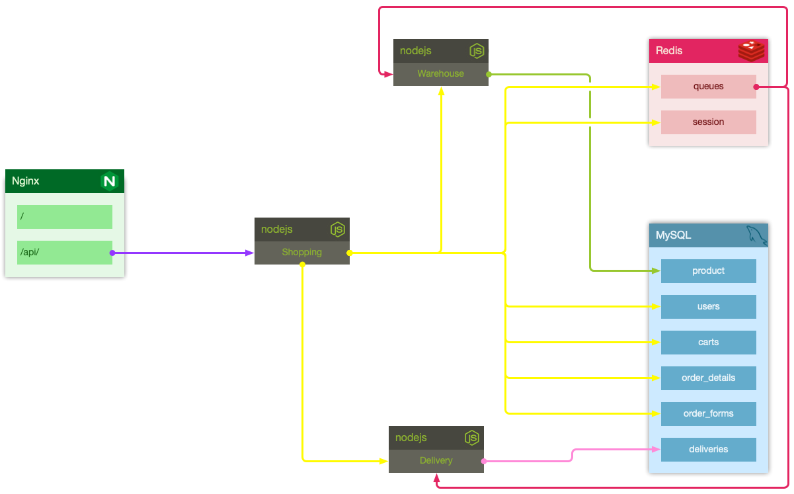
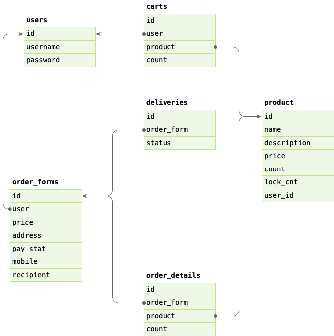

# 设计文档

简易版本

## 概要设计

### 功能

#### 用户

* 登录
* 注销
* 注册

#### 购物

* 浏览与搜索
* 查看详情
* 加入购物车
* 查看购物车
* 下单、调整库存并更改物流状态

#### 物流

* 查询

#### 管理

* 录入商品
* 下架商品

### 服务

* nginx 代理 —— 前端及反向代理，采集访问日志
* shopping-system —— 购物系统，提供用户、订单、购物车功能
* warehouse —— 上下架商品，扣减库存
* delivery —— 物流系统，提供物流功能

## 详细设计

### 功能模块示意图

### 表结构设计

### 接口设计

#### shopping

##### 注册

*请求*

    POST /api/register
    {
        "username": "jerry",
        "password": "******",
        "password_confirmation": "******"
    }

*响应*

    {
        "defaultGuard": "api",
        "guards": {
            "api": {
                "isLoggedIn": true,
                "isGuest": false,
                "authenticationAttempted": true,
                "isAuthenticated": false,
                "user": {
                    "username": "jerry",
                    "created_at": "2021-03-27T20:27:16.794+08:00",
                    "updated_at": "2021-03-27T20:27:16.794+08:00",
                    "id": 2
                }
            }
        }
    }

##### 登录

*请求*

    POST /api/login
    {
        "username": "jerry"
        "password": "******"
        "remember_me": true
    }

*响应*

    {
        "type": "bearer",
        "token": "Y2ttcnI0ZHR5MDAwMGRxczYzYTk1OTR1cw.xXVu2Urj--Ucihhz-t-pMNIUqkkj9EhiFstwKCLtGMivN6lqR29GhJvAVKl0"
    }

##### 注销

*请求*

    POST /api/logout

##### 直接下单

*请求*

    POST /api/order
    {
        "product": [{
            "id": 1,
            "count": 1
        }],
        "carts": [],
        "address": "xxxx",
        "mobile": "12345677890"
    }

##### 加入购物车

*请求*

    POST /api/cart
    {
        "product": "xxx",
        "count": 1
    }

##### 查看购物车

*请求*

    GET /api/cart

##### 清理购物车

*请求*

    DELETE /api/cart
    ["id1", "id2"]

#### warehouse

##### 录入商品

*请求*

    POST /api/warehouse/product
    {
        "name": "xxxx",
        "description": "xxxxxx",
        "price": 23,
        "count": 12
    }

##### 浏览

*请求*

    GET /api/warehouse/product?q=

##### 商品详情

*请求*

    GET /api/warehouse/product/:id

#### delivery

##### 查询订单物流

*请求*

    GET /api/delivery/:order_id

### 异步任务

1. 减库存——warehouse
2. 更改物流状态——delivery
